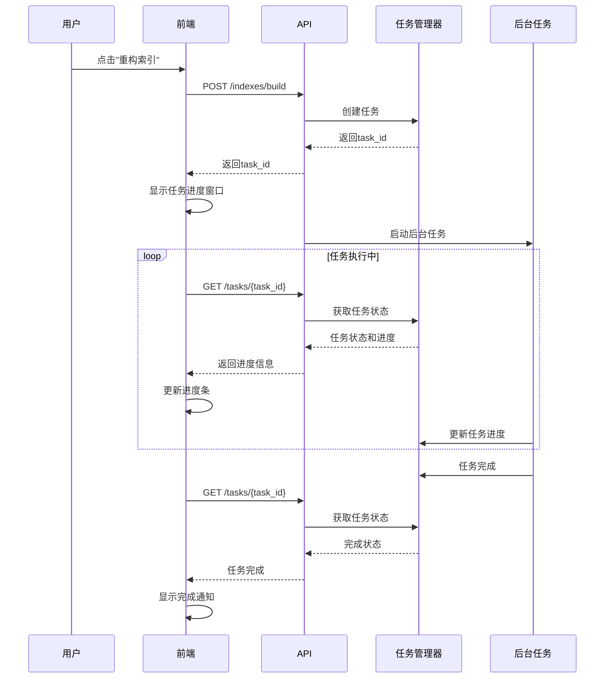

# UltrasoundRAG 异步任务系统解决方案

## 🎯 问题解决方案

### 原问题
- 前端点击重构索引后，后端开始长时间任务（1小时+）
- 前端会显示网络连接失败，无法做其他操作
- 用户无法看到任务进度

### 解决方案
实现了完整的**异步任务系统 + 实时进度追踪**

## 🏗️ 技术架构

### 1. 后端异步任务系统

#### TaskManager 类
```python
class TaskManager:
    """全局任务管理器"""
    def __init__(self):
        self.tasks: Dict[str, Task] = {}
        self._lock = threading.Lock()
    
    def create_task(self, name: str) -> str:
        """创建新任务，返回任务ID"""
        
    def update_task(self, task_id: str, status, progress, message, result, error):
        """更新任务状态和进度"""
        
    def get_task(self, task_id: str) -> Optional[Task]:
        """获取任务详情"""
```

#### 任务状态枚举
```python
class TaskStatus(str, Enum):
    PENDING = "pending"     # 等待中
    RUNNING = "running"     # 运行中
    COMPLETED = "completed" # 已完成
    FAILED = "failed"       # 失败
    CANCELLED = "cancelled" # 已取消
```

### 2. API端点改进

#### 原API（同步）
```http
POST /indexes/build
# 返回：直接等待完成，可能超时
```

#### 新API（异步）
```http
POST /indexes/build
# 返回：{ "success": true, "task_id": "uuid-123", "message": "任务已启动" }

GET /tasks/{task_id}
# 返回：{ "success": true, "data": { "status": "running", "progress": 45.0, "message": "正在处理..." } }

GET /tasks
# 返回：所有任务列表

DELETE /tasks/{task_id}
# 删除已完成的任务
```

### 3. 前端实时追踪系统

#### TaskStore (Pinia)
```javascript
export const useTaskStore = defineStore('task', () => {
  const startTaskTracking = (taskId, onUpdate, onComplete, onError) => {
    // 每2秒查询一次任务状态
    const intervalId = setInterval(async () => {
      const task = await getTaskStatus(taskId)
      
      if (task.status === 'completed') {
        stopTaskTracking(taskId)
        onComplete(task)
      } else if (task.status === 'failed') {
        stopTaskTracking(taskId)
        onError(task)
      } else {
        onUpdate(task)
      }
    }, 2000)
  }
})
```

#### TaskProgress 组件
- **进度模态框**: 显示详细的任务进度
- **浮动任务指示器**: 显示运行中的任务数量
- **任务管理抽屉**: 查看所有任务状态
- **自动追踪**: 自动轮询任务状态更新

## 🎛️ 用户界面改进

### 1. 进度显示界面

#### 任务详情模态框
```vue
<a-modal title="任务详情" :closable="!isRunning">
  <!-- 任务信息 -->
  <a-descriptions>
    <a-descriptions-item label="任务名称">{{ task.name }}</a-descriptions-item>
    <a-descriptions-item label="任务状态">
      <a-badge :status="getStatusBadge(task.status)" />
    </a-descriptions-item>
  </a-descriptions>
  
  <!-- 进度条 -->
  <a-progress :percent="task.progress" />
  
  <!-- 当前状态消息 -->
  <div>{{ task.message }}</div>
</a-modal>
```

#### 浮动任务指示器
```vue
<div class="floating-tasks" v-if="hasRunningTasks">
  <a-badge :count="runningTaskCount">
    <LoadingOutlined spin />
    {{ runningTaskCount }} 个任务运行中
  </a-badge>
</div>
```

### 2. 任务管理功能

#### 任务列表
- ✅ 查看所有任务（待处理、运行中、已完成、失败）
- ✅ 实时进度显示
- ✅ 任务状态监控
- ✅ 清除已完成任务
- ✅ 删除单个任务

#### 集成位置
- **仪表盘**: 索引构建按钮 → 启动异步任务 → 显示进度
- **集合管理**: 重建集合按钮 → 启动异步任务 → 显示进度
- **全局浮动**: 任务运行时显示浮动指示器

## 🚀 使用流程

### 1. 用户操作流程



### 2. 代码示例

#### 仪表盘中启动任务
```javascript
const buildIndexes = async () => {
  try {
    const response = await systemAPI.buildIndexes({
      target: 'all',
      recreate: false
    })
    
    if (response.data.success) {
      const taskId = response.data.task_id
      message.success('索引构建任务已启动！')
      
      // 显示任务进度追踪
      if (taskProgressRef.value) {
        taskProgressRef.value.showProgress(taskId)
      }
    }
  } catch (error) {
    message.error(`启动失败: ${error.message}`)
  }
}
```

#### 集合重建中启动任务
```javascript
const rebuildCollection = async (collectionName) => {
  try {
    const result = await collectionStore.rebuildCollection(collectionName)
    
    // 显示进度追踪
    if (result.taskId && taskProgressRef.value) {
      taskProgressRef.value.showProgress(result.taskId)
    }
  } catch (error) {
    console.error('重建集合失败:', error)
  }
}
```

## 🛠️ 技术特性

### 1. 异步任务特性
- ✅ **立即响应**: API调用立即返回，不会超时
- ✅ **后台执行**: 任务在独立线程中运行
- ✅ **状态管理**: 完整的任务生命周期管理
- ✅ **进度追踪**: 实时进度更新（0-100%）
- ✅ **错误处理**: 完善的错误捕获和报告

### 2. 前端特性
- ✅ **非阻塞操作**: 用户可以继续使用其他功能
- ✅ **实时更新**: 2秒间隔轮询任务状态
- ✅ **多任务管理**: 支持同时追踪多个任务
- ✅ **用户友好**: 直观的进度显示和状态提示
- ✅ **响应式设计**: 适配移动端和桌面端

### 3. 性能优化
- ✅ **资源管理**: 自动清理完成的任务追踪器
- ✅ **内存控制**: 任务数据结构优化
- ✅ **网络优化**: 高效的状态查询机制
- ✅ **用户体验**: 平滑的动画和过渡效果

## 📊 任务状态监控

### 任务信息展示
```json
{
  "id": "uuid-123",
  "name": "构建索引 - all",
  "status": "running",
  "progress": 65.0,
  "message": "正在处理图像索引...",
  "created_at": "2025-01-XX T10:30:00",
  "updated_at": "2025-01-XX T10:35:15",
  "result": null,
  "error": null
}
```

### 进度阶段示例（索引构建）
1. **10%** - "开始构建索引..."
2. **30%** - "正在初始化索引构建器..."
3. **60%** - "正在处理文档..."
4. **80%** - "正在优化索引..."
5. **100%** - "索引构建完成"

## 🎯 解决的核心问题

### 问题1: 前端超时
- **原因**: 长时间同步操作导致HTTP超时
- **解决**: 异步任务系统，立即返回任务ID

### 问题2: 无法执行其他操作
- **原因**: 前端被长时间请求阻塞
- **解决**: 非阻塞设计，任务在后台运行

### 问题3: 缺少进度反馈
- **原因**: 用户不知道任务执行状态
- **解决**: 实时进度追踪和状态显示

### 问题4: 任务失败处理
- **原因**: 任务失败时用户无法得知详细信息
- **解决**: 完整的错误信息展示和处理

## ✅ 最终效果

### 用户体验改进
1. **即时反馈**: 点击按钮后立即看到任务启动确认
2. **实时进度**: 清晰的进度条和状态消息
3. **自由操作**: 任务运行时可以使用其他功能
4. **状态通知**: 任务完成/失败时自动通知
5. **任务管理**: 可以查看、删除和管理所有任务

### 技术效果
1. **系统稳定性**: 消除了长时间请求导致的超时问题
2. **用户体验**: 提供了专业级的任务管理界面
3. **可扩展性**: 系统可以轻松支持更多异步操作
4. **监控能力**: 完整的任务执行监控和日志记录

## 🚀 总结

这个异步任务系统彻底解决了重构索引时的所有问题：

- ✅ **不再超时**: 任务立即启动，后台运行
- ✅ **实时进度**: 用户可以看到详细的执行进度
- ✅ **自由操作**: 任务运行期间可以正常使用系统
- ✅ **完善管理**: 提供了完整的任务管理功能
- ✅ **用户友好**: 现代化的界面和流畅的体验

现在用户可以放心地启动索引重建任务，既能看到实时进度，又不会影响系统的正常使用！ 🎉
