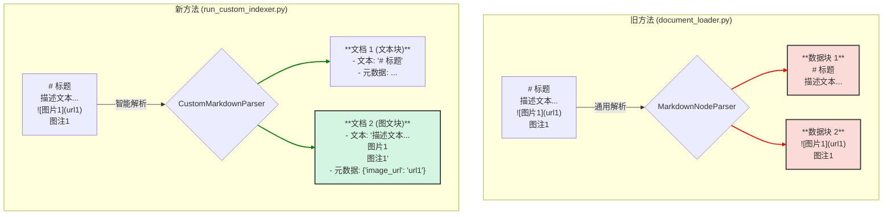

# MedicalRAG 索引模块优化说明

## 1. 背景与问题

初始的索引模块（`document_loader.py`）使用 LlamaIndex 提供的通用 `SimpleDirectoryReader` 和 `MarkdownNodeParser` 来加载和解析文档。这种方法虽然简单快捷，但存在一个核心问题：它无法理解医学文档（尤其是如 `01_超声标准切面图解.md`）中"图文并茂"的特殊结构。

在这些文档中，一张图片（如超声图像）和其前后的描述性文字、图注共同构成了一个不可分割的知识单元。通用解析器会机械地按标题或段落拆分文本，导致图片和其上下文描述被分割到不同的数据块中，从而破坏了信息的完整性。这会严重影响后续检索的准确性，因为描述图片的文本向量与图片本身失去了关联。

## 2. 优化策略与实现

为了解决上述问题，我们放弃了通用解析方案，转而设计并实现了一套**面向图文结构的智能解析和索引流程**。

核心实现包含两个新文件：
1.  `MedicalRAG/index/custom_document_parser.py`
2.  `MedicalRAG/index/run_custom_indexer.py`

### 2.1. `CustomMarkdownParser`：智能图文解析器

我们创建了一个全新的解析器 `CustomMarkdownParser`，其核心逻辑如下：

- **识别图文单元**：通过正则表达式 (`!\[.*?\].*`) 定位 Markdown 文件中的图片。
- **捕获完整上下文**：当找到一张图片时，解析器会自动捕获其紧邻的**前一个段落（通常是描述）**和**后一个段落（通常是图注）**。
- **构建高内聚文档**：将捕获到的"描述文本 + 图片标题 + 图注"合并成一个单独的 `Document` 对象。
- **存储关键元数据**：将图片的 URL 和标题（Alt text）提取出来，存放在 `Document` 对象的 `metadata` 字段中。这为未来的多模态应用奠定了基础。
- **兼容纯文本**：对于不包含图片的普通文本段落，解析器依然会将其作为独立的 `Document` 进行处理，确保信息的全面性。

### 2.2. `run_custom_indexer.py`：定制化索引脚本

这个新脚本负责调用 `CustomMarkdownParser` 并完成索引构建：

- **直接使用解析器**：脚本会遍历所有 Markdown 文件，并使用 `CustomMarkdownParser` 将每个文件解析成一个 `Document` 对象列表。
- **绕过标准节点解析**：我们把 `CustomMarkdownParser` 生成的 `Document` 列表直接传递给 `VectorStoreIndex.from_documents()`。由于我们的文档块已经是具有高度语义内聚的单元，因此**不再需要 LlamaIndex 的 `NodeParser`** 进行二次分割。
- **隔离存储**：为了与旧索引区分，新索引被存储在一个名为 `medical_rag_custom` 的新 ChromaDB 集合中。

## 3. 核心优势

本次优化带来了三个核心优势：

1.  **上下文完整性 (Contextual Integrity)**：最重要的提升。通过将图文信息打包，我们生成的向量能够更精确地反映一个知识单元的完整语义，极大提升了检索质量。
2.  **面向未来的多模态支持 (Future-Proof for Multimodality)**：在元数据中保存图片 URL，使得未来的应用可以在检索结果中直接展示图片，甚至可以扩展到真正的多模态检索（例如，使用视觉模型对图片内容进行编码）。
3.  **精确的语义分块 (Semantic Chunking)**：我们的分块策略是基于内容的内在逻辑（一个图文单元是一个整体），而非机械规则。这从源头上保证了输入RAG系统的数据质量。

## 4. 新旧方法对比图

以下图示直观地展示了优化前后的区别：

